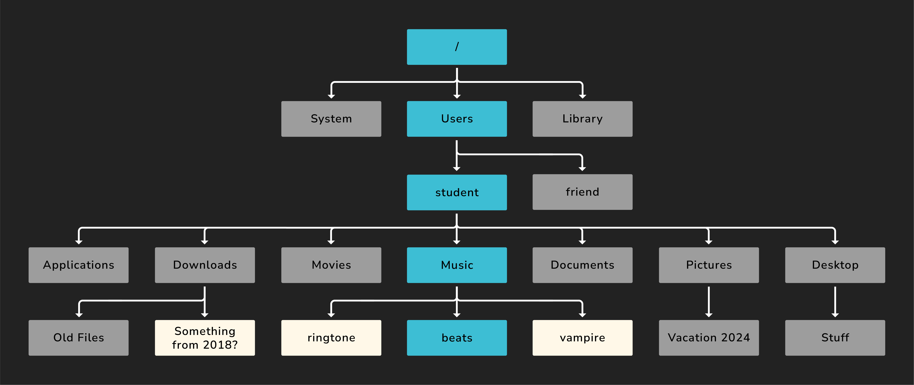

<h1>
  <span class="headline">Intro to the Terminal and Bash Scripting</span>
  <span class="subhead">Navigating and Manipulating File systems</span>
</h1>

**Learning objective:** By the end of this lesson, students will be able to confidently navigate directories and manipulate files and folders from the command line.

## Understanding your file system

Your computer’s file system is like a giant tree where folders (directories) are branches and files are leaves. To work efficiently in a terminal, you’ll need to know how to move around this tree and perform basic file operations—all without clicking any icons.

<br>



<br>

### Common file system terms

When speaking about a file system you'll often here the following terms used:

- **Directories:** Another word for folders.
- **Paths:** The “addresses” of files and folders on your computer.
- **Home Directory (~):** Your user’s starting point.
- **Current Directory (.):** The directory you’re currently in.
- **Parent Directory (..):** One level up in the folder tree.

## Common bash commands

| Command          | Explanation                                     |
| ---------------- | ----------------------------------------------- |
| `ls`             | List the contents of the current directory      |
| `ls -a`          | List all contents, including hidden files       |
| `ls -l`          | List contents in long format (details)          |
| `cd`             | Change directory (move into a folder)           |
| `pwd`            | Print working directory (your current location) |
| `mkdir`          | Make a new directory                            |
| `mv file1 file2` | Move or rename a file                           |
| `cp file1 file2` | Copy a file                                     |
| `cp -r`          | Recursively copy a folder and its contents      |
| `rm file`        | Remove (delete) a file                          |
| `rm -rf`         | Remove a folder and all its contents (danger!)  |
| `touch`          | Create a new file                               |
| `code .`         | Open the current folder in VS Code              |
| `history`        | List recent commands                            |
| `.`              | Reference the current folder                    |
| `..`             | Reference the parent folder                     |
| `~`              | The home directory of the current user          |

## Useful keyboard shortcuts in the terminal

| Shortcut | Explanation                      |
| -------- | -------------------------------- |
| Ctrl + C | Stop the current running process |
| Ctrl + R | Search and cycle through history |
| Cmd + T  | Open a new tab                   |
| TAB      | Autocomplete commands and paths  |

These shortcuts help speed up your workflow. Don’t worry if you don’t remember them all immediately—like the commands, you’ll pick them up as we practice.

<br>

<div class="activity guided-walkthrough">
  <h2 class="title">Navigating the file system with the terminal</h2>
  <span class="minutes">10 min</span>
</div>

Let’s try out some basic navigation and file operations.

### 1. Navigate to your `Desktop`

```bash
cd ~/Desktop
```

### 2. Check your current location:

```bash
pwd
```

You should see a path ending with `/Desktop`.

### 3. Create a new folder

```bash
mkdir practice-folder
```

### Verify creation:

```bash
ls
```

`practice-folder` should be listed.

### Move into the new folder

```bash
cd practice-folder
```

### Confirm your location

```bash
pwd
```

The path should end with `.../Desktop/practice-folder`.

### Create a file inside the folder

```bash
touch hello.txt
```

### List the folder contents

```bash
ls
```

`hello.txt` should be present.

### Open the folder in VS Code (optional)

```bash
code .
```

### Navigate back out

```bash
cd ..
```

### Check your location again

```bash
pwd
```

You’re now back on your Desktop!

<br>

<div class="activity solo-exercise">
  <h2 class="title">Command Line Practice (Optional)</h2>
  <span class="minutes">10 min</span>
</div>

If you’d like more hands-on practice with the CLI, we’ve prepared some exercises below to help you reinforce these skills and build muscle memory.

## Basic Practice

- Navigate to your Desktop.
- Create a directory named `films`.
- Change into the `films` directory.
- Create a file named after your favorite film.
- Open that file in VS Code and add some text.
- In a single command, create three additional files for other films.
- Rename one of those films to its sequel’s title.
- Open the entire `films` directory in VS Code to view all files and make any changes.
- Delete your two least favorite films.

## Advanced Practice

Already a terminal wizard? Let's put those CLI skills to the test!

- Navigate to your Desktop.
- In a single command, create a directory called `terminal-practice-1` and move into it.
- In a single command, create the following file structure:

  ```
  index.html
  |
  |___css
  |   |__main.css
  |   |__main.scss
  |
  |___js
      |__app.js
  ```

- Return to your Desktop directory.
- In a single command, create a new directory called `terminal-practice-2` and move all contents from `terminal-practice-1` into `terminal-practice-2`.
- Delete `terminal-practice-1`.
- Rename `terminal-practice-2` to `terminal-practice`.
