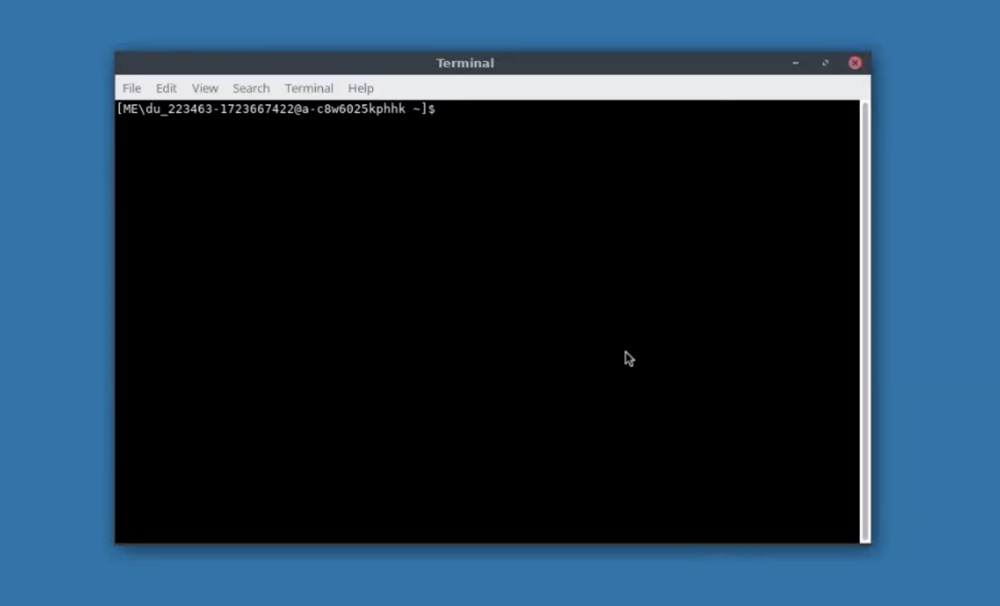

<h1>
  Intro to the Terminal and Bash Scripting
  What is the Terminal?
</h1>

**Learning objective:** By the end of this lesson, learners will be able to explain the difference between GUI and CLI environments.

## Communicating with a computer

When humans need to communicate with a computer, there are two main options:

### 1. Using a GUI (Graphical User Interface)

The most familiar way to interact with a computer is through a Graphical User Interface (GUI). A GUI provides a visual representation of the files, applications, and data on your computer. For example, when you see icons on your desktop and click on one with your cursor, you’re instructing the computer to open a file or run a program. This point-and-click interaction makes it easy for users to communicate with their computer without needing to type commands. It’s a friendly, intuitive way to interact.

### 2. Using a Terminal (Command Line Interface)

Terminal applications provide a shell environment where you can interact with your computer by typing commands directly into a command-line interface. These applications typically feature a simple, text-based interface (usually just a plain box) where you input specific instructions to open files, run programs, or navigate through directories. Instead of clicking icons, you type out what you want to do. It provides a faster, more powerful way to interact with the operating system directly.

The terminal is known by various names—such as "shell," "terminal," or "CLI"—but they all refer to the same basic experience.

## What does a terminal look like?

Terminal applications vary by operating system.

- On macOS, there’s the `Terminal` app
- On Windows, you have `CMD` or `PowerShell`
- On Linux, you have various terminals like `GNOME` Terminal

All of these allow you to interact directly with your computer’s operating system through a text-based interface.

When you open a terminal, you’ll usually see a blank screen with one line of text at the top—this is your **_command line_**.

The **command line** often contains three key pieces of information:

- **User:** Who is currently logged in or the name of the VM or machine you’re on.
- **Location:** Where you are in the file system. For example, if you’re in the root directory, it might be `~` or `/`. If you navigate into a folder, you’ll usually see that folder’s name listed before the prompt.
- **Prompt:** This is a character (often `$`) indicating that the terminal is ready for you to type a command. Once you see the prompt, the system is listening and ready to follow your instructions.

 

 

## The language of the terminal

Shell environments can use different “languages” or shells for giving the system commands.

The most common one is [**Bash**](<https://en.wikipedia.org/wiki/Bash_(Unix_shell)>), short for “Bourne Again SHell.” Bash is widely used, reliable, and a great starting point for beginners. It’s essentially the language your terminal will “speak” as you type commands to navigate your system, run applications, and perform all sorts of tasks without ever clicking an icon.

In this lesson, we'll explore key Bash commands and concepts, building a solid foundation for working in the CLI.
